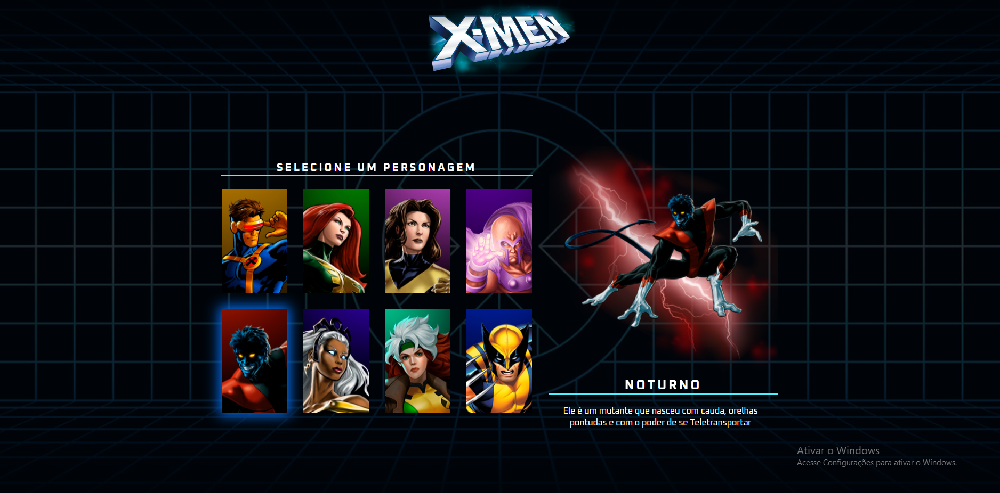

    

## 🖥️ Projeto X-Men do Dev em Dobro
Este é um projeto Web Responsivo de uma página de card de alguns personagens da animação x-men.

## 🧠 Lógica
A página é simples, tem algumas imagens (cards) dos personagens, quando o usuário passa o mouse por cima, a imagem fica selecionada brilhando e ao seu lado uma imagem maior do personagem selecionado é exibida, junto com sua descrição 

## 🚀 Tecnologias
Para este projeto ser desenvolvido, foram usadas as seguintes tecnologias:

-HTML
-CSS
-JAVASCRIPT

Eu por conta criei o repositório usando Git e Github